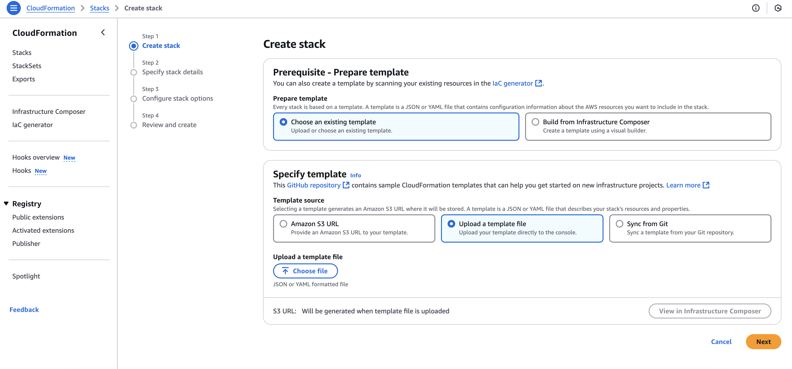

## Overview:

This lab activity will demonstrate how to create a CloudFormation stack using the AWS console. Once you have finished the lab, you need to commit the CloudFormation template to a Github repository

Prerequisite: 
- This activity will require a terminal, VS Code or your own github repository for editing.

## 1. Create a CloudFormation stack.

1. Create a file named static-cf.yml, and copy the template from this URL: 

https://github.com/olyvenbayani/labs-IaC-Lab01.git

If you're using a terminal you can use:

```sh
sudo nano static-cf.yml
```

If you're using VS Code or Github, you can create a new file and paste the template's content.

2. Set the name of your bucket, add some random characters to the name of your bucket to make it unique. Also set the security group and subnet id. 


\

3. Go to AWS Management Console and go to Cloudformation.


4. Click Create stack > With New resources (Standard) 


5. Click Choose an existing template and under Specify template choose to "upload a template file" then upload the static-cf.yml you edited earlier.




6. Give the stack a name such as cf-static-demo-<your-initials>-1


7. Navigate back to the CloudFormation console and check your stack.

It created an S3 bucket and EC2 instance.


## 2. Create a new stack using the same CloudFormation template

1. Navigate back to the cloudformation console and create a new stack using the same template.

2. Make sure to create an iterated name such as:

cf-static-demo-<your-initials>-2

3. You’ll see that there will be an error, the S3 namespace is universal and we cannot create a bucket name that is not unique.


Therefore the template we have used to create resources is considered static, although it works. We cannot reuse the template to create the same set of resources unless we rename it.


## 3. Create a stack using a dynamic CloudFormation template.


1. Navigate to your terminal and create a file named dynamic-cf.yml and paste the template from earlier's url: 

https://github.com/olyvenbayani/labs-IaC-Lab01/blob/5e3ebe575cea10b5f65e457b120202d87e5c02c8/dynamic-template.yml

Again, if you're using a terminal/CLI you can run:
```sh
nano dynamic-cf.yml
```


2. Go back to the cloudformation and do the same thing instead this time create a new stack from the dynamic template.

3. Enter your VPC, Subnet and a new S3 bucket name

4. You can use a naming convention such as:

cf-dynamic-demo-<your-initials>-1

5. Navigate to the CloudFormation console and check the stack. The stack was successfully created!


6. Create another stack using the same template with a new name such as:

cf-dynamic-demo-<your-initials>-2

7. Enter your VPC, Subnet and a new S3 bucket name

8. Navigate back to the CloudFormation console and check the recently created stack.


---------

Well done!!! Now lets delete the stack by clicking on the cf stacks you created and click Delete button.

As you can see the buckets and instances created was actually deleted too. 

Congratulations on finishing the lab.
